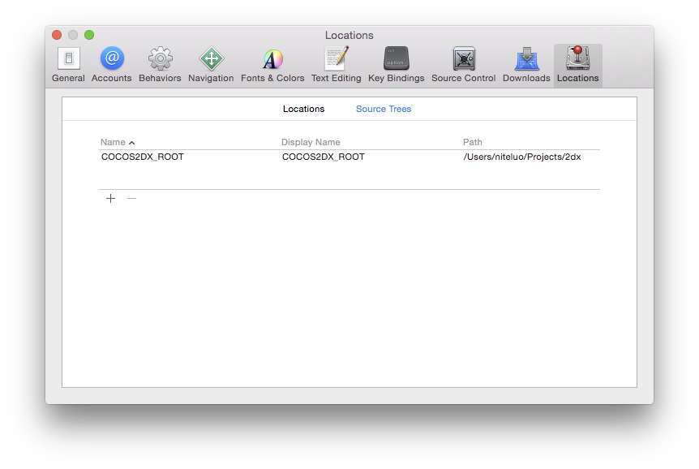

# Cocos2d-x templates for prebuilt lib

## Intro
This is a template project which you can use with prebuilt cocos2d-x libraries.

It works with cocos2d-x repo and cocos2d-x 3.8

Before using this template, you can follow [this guide](docs/create_prebuilt.md) to generate prebuilt cocos2d-x libs

## Notice
* Currently only iOS and android project works

## How it works
### For iOS
Set COCOS2DX_ROOT environment variables for xcode

### For Android
Update `build_cfg.json` and replace <replace_with_COCOS2D-X_ROOT> with path to your cocos2d-x engine
